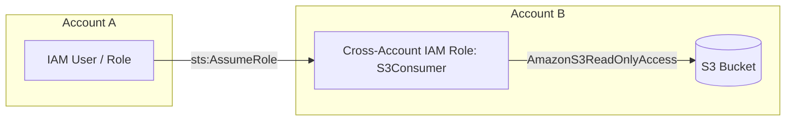

# Lab 01: Cross-Account IAM Role S3 Access

## Objective
Enable Account A to securely access an S3 bucket in Account B via an IAM role and trust policy.

## Scenario
- Account A (data team) must access `bucket_name` in Account B.
- Achieved by creating a cross-account IAM role in Account B that Account A can assume.

## Architecture Diagram
## Architecture Diagram



## Usage

### 1. Edit Variables
Adjust `variables.tf` values if your **Account IDs** or **S3 bucket name** differ from defaults.

---

### 2. Deploy
For separate AWS accounts/profiles, configure your **Terraform CLI** or **AWS credentials** accordingly:

```bash
terraform init
terraform plan
terraform apply
```
### 3. Test
From Account A, assume the role in Account B:

```bash
aws sts assume-role \
  --role-arn arn:aws:iam::<AccountB_ID>:role/CrossAccountS3Access \
  --role-session-name test-session \
  --profile account_a
```
Use the returned temporary credentials to test S3 operations, for example:

```bash
aws s3 ls s3://<bucket_name> \
  --profile account_a
```
### 4. Cleanup
Tear down resources when finished:

```bash
terraform destroy
```

## Troubleshooting

Ensure your Account IDs and bucket names are correct.
Verify both the trust policy (Account B role) and permissions policy (Account A).
Run terraform plan to validate before applying.

## References

[AWS Tutorial: Delegate access across AWS accounts using IAM roles](https://chatgpt.com/g/g-p-68c5ab47249081919ddd4124e53e1baf-hands-on-labs/c/68c5ac28-4f50-8321-b805-e9b46a14123d#:~:text=AWS%20Tutorial%3A%20Delegate,AWS%20Provider%20Documentation)

[Terraform AWS Provider Documentation](https://chatgpt.com/g/g-p-68c5ab47249081919ddd4124e53e1baf-hands-on-labs/c/68c5ac28-4f50-8321-b805-e9b46a14123d#:~:text=AWS%20Tutorial%3A%20Delegate,AWS%20Provider%20Documentation)


